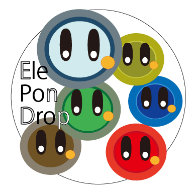

# Hi there, I'm koto2730 👋

## Software Engineer | Mobile Developer | CS Student
**Enterprise reliability meets agile, AI-driven innovation.**
（業務システムの信頼性と、AIを駆使したモダンな開発を融合させるエンジニアです）

---

### 💡 My Three Pillars (3つの柱)

1. **Enterprise Experience (Java/Backend)**
    - 業務アプリケーション開発の豊富な経験。Java(資格保有)/C等の多様な言語での堅牢な設計・運用。
    - Experienced in enterprise systems with Java, VB, and C. Focus on robustness and scalability.

2. **AI-Driven Mobile Development (Flutter/React-Native)**
    - 自ら設計を主導し、AIエージェントを駆使して高速に形にする開発スタイル。
    - Focus on AI-assisted development, architecting products while leveraging AI for efficient coding.

3. **Continuous Learning in CS & Data Science (Re-enrolled)**
    - 現代の技術進化に対応するため情報系大学に再入学。最新のCSとデータサイエンスを習得中。
    - Returning to university to master modern CS and Data Science, building upon a prior degree in Information Science.

---
  
### 🏆 Credentials & Continuous Learning (資格・実績)

- **Technical Certification:**
    - **Applied Information Technology Engineer (応用情報技術者)**
    - National certification for advanced IT knowledge and systems design.
    - *Note: Original certification available for verification upon request during the interview process.*
    - (高度なIT知識と設計能力を証明する国家資格。原本は面談等の際に提示可能です。)
- **Global Communication & Consistency:**
  - **English: 1100+ Day Streak on Duolingo 🔥**
    - *Demonstrating exceptional commitment to daily learning and global collaboration.*
- **Education:**
  - **B.S. in Computer Science (Ongoing)** - Re-enrolled to master modern Data Science and computing.
  - **B.A. in Information Science (Prior)** - Solid foundation in Informatics.
  - **Digital Badge (OpenID/OpenBadge):**
  - Verified digital credential for Computer Science & Mathematics.
  - *Details and verification link available upon request for privacy reasons.*
  - (CS・数学関連のオープンバッジを保有。プライバシー保護のため、検証用リンクは個別にお伝えします。)

---

### 🚀 Featured Products

| Icon | App Name & Links | Technical Highlights (EN / JP) | Year |
| :--- | :--- | :--- | :--- |
|  | **FlowCards** [iOS](https://apps.apple.com/us/app/flowcards/id6751177827) / [Android](https://play.google.com/store/apps/details?id=com.flowcards) / [Repo](https://github.com/koto2730/flowcards) | **Full-featured organizer with Obsidian sync.** 本格的な情報整理ツール。Obsidian連携機能を搭載。 | 2025 |
|  | **Flood Of Lights.** [iOS](https://apps.apple.com/jp/app/flood-of-lights/id1523192881) / [Android](https://play.google.com/store/apps/details?id=com.mugime.floodoflights) | **Visual effects using Shaders in React-Native.** React-Nativeでのシェーダー利用に挑戦したリラックスアプリ。 | 2021 |
|  | **コンセプトメイカー** [iOS](https://apps.apple.com/jp/app/concept-maker/id1563537804) / [Android](https://play.google.com/store/apps/details?id=com.mugime.conceptmaker) | **Idea generation tool created before the AI era.** 生成AI流行以前に、着想を支援するために設計したツール。 | 2022 |
|  | **エレぽんドロップ-お試し版** [Android](https://play.google.com/store/apps/details?id=com.mugime.elepondrop) | **Exploring GDScript's efficiency.** GDScriptの書きやすさを追求。C#不要論を実感した作品。 | 2023 |
|  | **宇宙探検** [Android](https://play.google.com/store/apps/details?id=com.mugime.starexplorer) | **Classic Android game developed in Java.** JavaでのAndroid開発。外部クリエイターと協力したプロジェクト。 | 2010s |

> ※ **Other apps:** Integrated camera features for testing mobile capabilities. (MemoriesMemo), Utilized QR code libraries within React-Native workflow (ThinkingMemo), and more.

---

### 📂 Key Repositories & Logs

- 📝 **[のんびり開発日記 (Blog)](https://koto2730.github.io/nonbiri-dev-log/)** - 開発のプロセスや学びを記録しています。
- 📦 **[pymemo](https://github.com/koto2730/pymemo)** - 20年以上前に業務とは別に個人開発していたPythonコードを公開。エンジニアとしての足跡です。
- 🔄 **[LocalNode](https://github.com/koto2730/localnode)** - ローカルデバイス間のファイル同期アプリ（現在AIを駆使して開発中）。

---

### 🛠 Tech Stack

- **Languages:**    
- **Frameworks:**    
- **Current Study:**   (Data Science & Modern System Programming)

---

### 📊 GitHub Activity

---

### 💬 Contact
- **Inquiries:** [koto2730oss@gmail.com](mailto:koto2730oss@gmail.com)
  - *For professional opportunities or detailed CV/LinkedIn requests, please contact me via email.*
- **Social:** [X (@koto2730oss)](https://x.com/koto2730oss)
- **Timezone:** JST (UTC+09:00)
